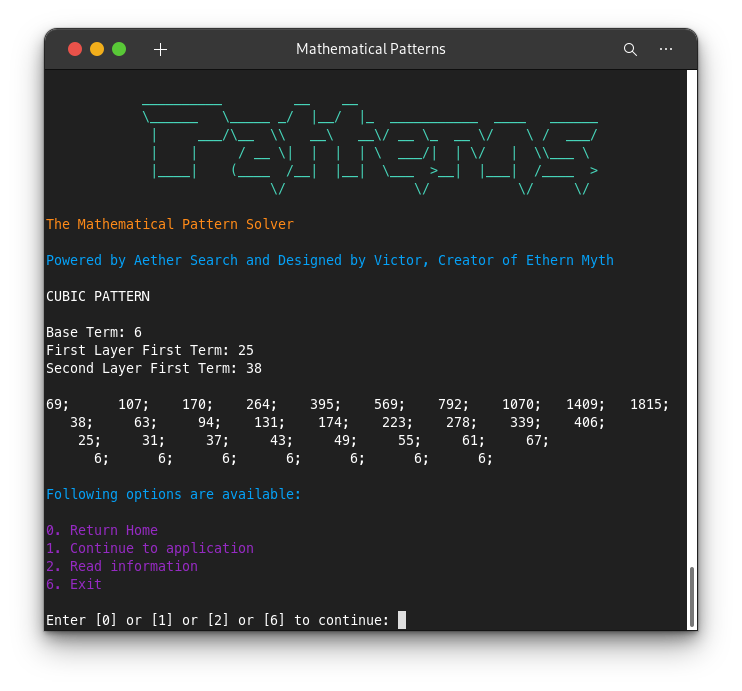

# AetherPatterns
*Powered by Aether Search and Victor, Creator of Ethern Myth*

This app is inspired by OOP, pattern design and algorithms. If you find free time, look through the coding patterns used to achieve the output.





Key take aways as of now from the patterns are as:

1. **Quadratic Pattern** - T(n) = an² + bn + c

2. **Cubic Pattern** - T(n) = an³ + bn² + cn + d

3. **Quartic Pattern** - T(n) = an⁴ + bn³ + cn² + dn + e

> In Addition: 
* Coding used for pattern design is singleton.
* Use of new C#10 features to enhance the app.
* The rest is algorithm inspired as aforementioned.

> What is next ?
* Ability to either type the pattern of the equation and resolve either one.
* Ability to leave details of the equation or equation. Determination will be done.

> Begin Now
___
Download app of your machine type and check it out now.

For Windows: Both x64 and x86 are available

For Mac: Only x64 available

For linux: Supported as Windows.


## To Install on linux

Go to the downloaded file directory and copy the lines to your terminal:

```bash
sudo chmod +x AetherPatterns-x64

sudo ./AetherPattern-x64

```
Note: Copy each line by line as sometimes terminals might be configured to global settings.
____
**Thank you** very much if saw this.
